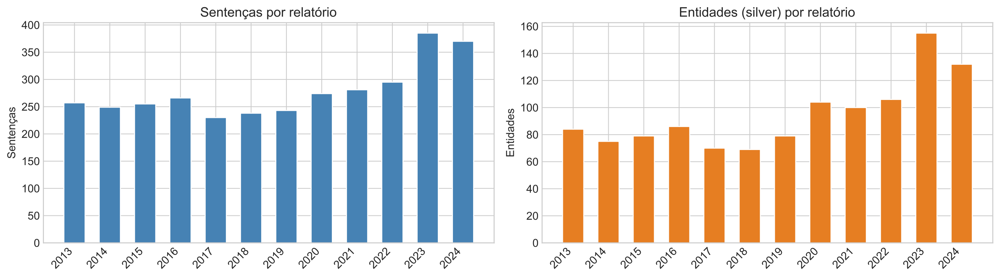

# EpiCorpus-BR

**A Named Entity Recognition corpus for epidemiological documents in Brazilian Portuguese.**

[](https://aclanthology.org/2026.stil-1.13/)
[](https://doi.org/10.5753/stil.2026.26614)
[](data/LICENSE)
[](LICENSE)

> Christian Freitas and Lilian Berton. **EpiCorpus-BR: A Named Entity Recognition Corpus for
> Epidemiological Documents in Portuguese.** In *Proceedings of the 17th Brazilian Symposium in
> Information and Human Language Technology (STIL 2026)*, pages 150–162, Cuiabá, Brazil.
> [[PDF]](https://aclanthology.org/2026.stil-1.13.pdf) [[ACL Anthology]](https://aclanthology.org/2026.stil-1.13/)

EpiCorpus-BR is an annotated NER corpus built from the annual **SIREVA-SUS** surveillance
reports (2013–2024) and complementary epidemiological documents from the Brazilian
Ministry of Health. This repository contains the corpus and the full pipeline used
to build and evaluate it: PDF extraction, silver annotation, gold-standard sampling and
review, inter-annotator agreement, evaluation, and a BERTimbau baseline.

| | |
|---|---|
| Documents | 22 (12 SIREVA-SUS reports + 10 complementary documents) |
| Textual units | 8,314 (6,358 narrative sentences + 1,956 table rows) |
| Silver mentions | 4,159 |
| Gold standard | 280 units (180 sentences + 100 table rows), 1,189 mentions |
| Inter-annotator agreement | Cohen's κ = 0.76 |
| Silver vs. gold (strict IOB2) | micro-F1 = 0.77 |
| BERTimbau baseline (trained on silver, tested on gold) | micro-F1 = 0.73 |

## Tagset

| Tag | Description | Examples |
|---|---|---|
| `PATOGENO` | Disease-causing organism | *Streptococcus pneumoniae*, meningococo |
| `SOROTIPO` | Serological identification | sorotipo 19A, sorogrupo B, tipo b |
| `FAIXA_ETARIA` | Age stratum | menor que 12 meses, 60 anos ou mais |
| `LOCAL` | Named geographic location | Brasil, São Paulo, região Sudeste |
| `PERIODO_TEMPORAL` | Explicit time delimitation | 2024, semana epidemiológica 35 |
| `METODO_LAB` | Laboratory or diagnostic technique | PCR em tempo real, MALDI-TOF |
| `METRICA_EPI` | Named epidemiological measure (not the value) | taxa de incidência, letalidade |
| `MANIFESTACAO_CLINICA` | Disease, syndrome or clinical condition | meningite, doença invasiva, sepse |

Full annotation guidelines: [`annotation/guidelines.md`](annotation/guidelines.md).

### Mention distribution

| Category | Silver (SIREVA-SUS) | Gold – text | Gold – tables | Gold – total |
|---|---:|---:|---:|---:|
| `LOCAL` | 592 | 154 | 0 | 154 |
| `PATOGENO` | 379 | 54 | 2 | 56 |
| `FAIXA_ETARIA` | 57 | 46 | 116 | 162 |
| `METODO_LAB` | 54 | 38 | 54 | 92 |
| `SOROTIPO` | 24 | 21 | 0 | 21 |
| `PERIODO_TEMPORAL` | 18 | 5 | 2 | 7 |
| `MANIFESTACAO_CLINICA` | 15 | 6 | 31 | 37 |
| `METRICA_EPI` | 0 | 22 | 638 | 660 |
| **Total** | **1,139** | **346** | **843** | **1,189** |

Silver counts cover the 3,343 sentences of the 12 SIREVA-SUS reports; the 10 complementary
documents add 3,015 sentences and 3,020 silver mentions. `METRICA_EPI` is essentially
tabular, which is why table rows are part of the corpus.



## Results

Per-category F1 on the gold standard (seqeval, strict IOB2). *Gemini* is a second LLM annotator
(Gemini 2.5 Flash, same prompt); *BERTimbau* is fine-tuned on silver with the gold held out.

| Category | GPT-4o-mini text | GPT-4o-mini tables | GPT-4o-mini combined | Gemini combined | BERTimbau combined |
|---|---:|---:|---:|---:|---:|
| `PATOGENO` | 0.97 | 0.00 | 0.95 | 0.96 | 0.98 |
| `SOROTIPO` | 0.92 | 0.00 | 0.92 | 0.62 | 0.76 |
| `PERIODO_TEMPORAL` | 0.89 | 0.00 | 0.73 | 0.62 | 0.77 |
| `METODO_LAB` | 0.88 | 0.62 | 0.71 | 0.65 | 0.63 |
| `FAIXA_ETARIA` | 0.85 | 0.25 | 0.43 | 0.45 | 0.43 |
| `LOCAL` | 0.61 | 0.00 | 0.59 | 0.26 | 0.30 |
| `MANIFESTACAO_CLINICA` | 0.50 | 0.59 | 0.58 | 0.68 | 0.51 |
| `METRICA_EPI` | 0.00 | 0.91 | 0.89 | 0.94 | 0.89 |
| **Micro avg** | **0.73** | **0.79** | **0.77** | **0.77** | **0.73** |
| **Macro avg** | 0.70 | 0.34 | 0.73 | 0.65 | 0.66 |

Raw results are in [`data/evaluation/`](data/evaluation/).

## Data format

All annotated files are JSONL, one record per textual unit (sentence or table row):

```json
{
  "relatorio": "sireva_2019",
  "pagina": 36,
  "sentenca_id": "sireva_2019_s0161",
  "texto": "...",
  "tokens": ["...", "..."],
  "bio_tags": ["B-PATOGENO", "I-PATOGENO", "O"],
  "spans": [{"texto": "...", "tipo": "PATOGENO"}]
}
```

Tags follow the IOB2 scheme; tokenization is whitespace-based.

## Repository layout

```
data/
  extracted/            narrative sentences per document (JSONL)
  extracted_tables/     table rows per SIREVA-SUS report (JSONL)
  silver/               silver annotations, narrative text (GPT-4o-mini, few-shot)
  silver_tables/        silver annotations, table rows
  gold/                 manually reviewed gold standard
    gold_sample.jsonl     180 narrative sentences
    gold_tables.jsonl     100 table rows
  evaluation/           evaluation results (silver, Gemini, BERTimbau, IAA)
docs/figures/           figures used in this README
annotation/
  guidelines.md         annotation manual
  HANDOFF_IAA.md        instructions given to the second annotator
  samples/              sampled units and Label Studio import files
  review/               review spreadsheets of both annotators
src/
  extraction.py         PDF -> narrative sentences (Docling)
  table_extractor.py    PDF -> table rows (pdfplumber)
  silver_annotator.py   silver annotation via GPT-4o-mini
  sampling.py           stratified sampling of the gold set
  to_label_studio.py    export samples to Label Studio
  ls_to_gold.py         Label Studio export -> gold JSONL
  export_annotation_csv.py / gold_builder.py   spreadsheet review -> gold JSONL
  iaa.py                inter-annotator agreement (Cohen's kappa, span F1)
  evaluation.py         seqeval evaluation (strict, IOB2)
  gemini_annotator.py   second-LLM robustness check (Gemini 2.5 Flash)
  ner_baseline.py       BERTimbau fine-tuning baseline
scripts/
  process_boletins.py   extraction + annotation of the complementary documents
*.ipynb                 notebooks for silver annotation, sampling, evaluation and statistics
```

## Setup

Requires Python ≥ 3.11 and [uv](https://docs.astral.sh/uv/).

```bash
uv sync                      # core pipeline
uv sync --extra baseline     # + torch/transformers for the BERTimbau baseline
cp .env.example .env         # then fill in your API keys
```

API keys are only needed to re-run the LLM annotators; the released corpus can be used
without any key.

## Reproducing the pipeline

The source PDFs are not included in this repository. To re-run extraction, download
the SIREVA-SUS reports (2013–2024) and the complementary bulletins from the Ministry of
Health and place them in `data/` (e.g. `data/sireva_2024.pdf`). All later steps run
from the JSONL files already provided.

```bash
# 1. Extraction
python -m src.extraction                  # narrative text -> data/extracted/
python -m src.table_extractor             # tables -> data/extracted_tables/
python scripts/process_boletins.py        # complementary documents

# 2. Silver annotation (requires OPENAI_API_KEY)
python -m src.silver_annotator            # narrative text -> data/silver/
python -m src.silver_annotator --tables   # tables -> data/silver_tables/

# 3. Gold-standard sampling and review
python -m src.sampling
python -m src.to_label_studio             # add --tables for table rows
python -m src.ls_to_gold <export.json>    # add --tables for table rows

# 4. Agreement and evaluation
python -m src.iaa
python -m src.evaluation
python -m src.gemini_annotator            # requires GEMINI_API_KEY
python -m src.ner_baseline                # --split text | tables | combined
```

Tests: `uv run pytest`.

## License

- **Corpus annotations** (`data/`, `annotation/`): [CC BY 4.0](https://creativecommons.org/licenses/by/4.0/) — see [`data/LICENSE`](data/LICENSE).
- **Code**: MIT — see [`LICENSE`](LICENSE).
- The corpus is derived from official public documents of the Brazilian Ministry of Health,
  the Health Surveillance Secretariat and the Oswaldo Cruz Foundation (not redistributed
  here). They contain only population-level aggregated data; no patient personal data
  is included.

## Citation

If you use EpiCorpus-BR, please cite:

```bibtex
@inproceedings{freitas-berton-2026-epicorpus,
    title = "{E}pi{C}orpus-{BR}: A Named Entity Recognition Corpus for Epidemiological Documents in {P}ortuguese",
    author = "Freitas, Christian  and
      Berton, Lilian",
    editor = "Barbosa, Bryan Khelven da Silva  and
      Paes, Aline  and
      Felippo, Ariani Di",
    booktitle = "Proceedings of the 17th {B}razilian Symposium in Information and Human Language Technology",
    month = oct,
    year = "2026",
    address = "Cuiab{\'a}, Mato Grosso, Brazil",
    publisher = "Association for Computational Linguistics",
    url = "https://aclanthology.org/2026.stil-1.13/",
    doi = "10.5753/stil.2026.26614",
    pages = "150--162"
}
```

See also [`CITATION.cff`](CITATION.cff).

## Authors

- **Christian Freitas** — ICT/UNIFESP · [ORCID](https://orcid.org/0009-0001-4086-3455) · [Google Scholar](https://scholar.google.com/citations?user=8faAsLoAAAAJ) · christian.freitas@unifesp.br
- **Lilian Berton** — ICT/UNIFESP · [ORCID](https://orcid.org/0000-0003-1397-6005) · lberton@unifesp.br

## Acknowledgements

This work was supported by CAPES (Finance Code 001) and CNPq.
Instituto de Ciência e Tecnologia, Universidade Federal de São Paulo (UNIFESP).
